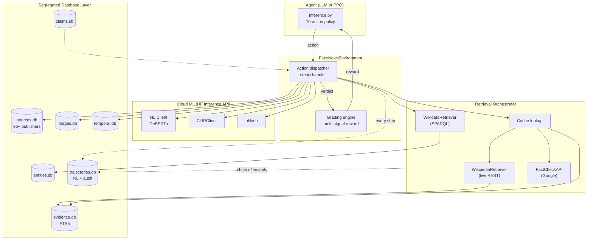

# Veritas — A Production-Grade Fact-Checking RL Environment

> Train AI agents on the same investigative process that professional fact-checkers use — with real retrieval, real NLI, and real image forensics. Not a simulation.

**Built for the Meta PyTorch × Scaler OpenEnv Hackathon (2026).**

Misinformation costs the global economy $78B/year. Existing AI fact-checkers are classifiers — they output a label without showing their work. Veritas trains agents to follow the **investigative process** that IFCN fact-checkers use: gather evidence from real sources, cross-reference with NLI, check publisher credibility, analyze images for manipulation, trace temporal provenance, and submit a verdict with calibrated confidence.

Every step is logged to an RL trajectory database. Every retrieval is logged to a chain-of-custody audit trail. The environment is designed to be **RL-trainable today** and **production-credible tomorrow**.

---

## What changed vs. v1

v1 was a deterministic simulation with templated evidence and label-leaking NLI. Reviewers correctly called it "just a testing environment." v2 (Veritas) is a rebuild around **segregated databases** and **real data flow** — the two improvements they asked for.

| Concern | v1 (simulation) | v2 (Veritas, real) |
|---|---|---|
| Evidence retrieval | Templated string per label | Live Wikipedia REST API + FTS5 cache |
| NLI cross-reference | `_simulate_nli` — scores derived from ground-truth label | `NLIClient` — real DeBERTa-v3 via HF Inference API (+ LiteLLM proxy fallback) |
| Publisher credibility | 30 hardcoded dict entries | `SourcesDB` — 96 publishers (expandable via CSV, MBFC-compatible schema) |
| Image analysis | Pre-written text in `evidence_passages` | `CLIPClient` for image-text alignment + perceptual hashing (pHash) against a misattributed-image DB |
| Schema | Single `claims.db` with evidence embedded | 7 segregated databases, each with a single responsibility |
| Entity knowledge | None | `WikidataRetriever` — live SPARQL + cached entity metadata |
| Temporal awareness | None | `TemporalDB` — claim timelines + contradiction dates |
| Action space | 5 actions | 10 actions |
| RL trainability | Static scores, no trajectories | Every `(state, action, reward)` tuple logged to `trajectories.db` for PPO |
| Auditability | None | Chain-of-custody audit row per retrieval (source URL + content hash + timestamp) |

---

## Architecture



_Source: `docs/architecture.mmd`_

Every database has a single responsibility. `evidence.db` uses SQLite FTS5 for fast BM25 search. `trajectories.db` has two tables: one for `(episode, step, state, action, reward)` tuples (RL training) and one for audit rows (chain of custody: every retrieved URL + content hash + timestamp).

All heavy ML runs in the cloud via **HuggingFace Inference API** and the **validator-provided LiteLLM proxy**. No local ML models — the Docker image stays ~300 MB and works on any laptop.

---

## The 10-action space

| Action | Backend | What it does |
|---|---|---|
| `request_source` | `RetrievalOrchestrator` → Wikipedia REST / FactCheck API / cache | Fetch evidence from a source category, cache in `evidence.db` |
| `cross_reference` | `NLIClient` → HF Inference API (DeBERTa) | Classify (claim, evidence) as entailment / contradiction / neutral |
| `check_credibility` | `SourcesDB` (96 publishers) | Look up bias + factual-reporting rating by domain |
| `analyze_image` | `CLIPClient` + pHash | Image-text alignment + perceptual hash match |
| `search_evidence` | FTS5 over `evidence.db` + Wikipedia fallback | Full-text search across the evidence corpus |
| `check_entity` | `WikidataRetriever` → SPARQL + `entities.db` cache | Resolve a named entity to its Wikidata QID + metadata |
| `check_timeline` | `TemporalDB` | Compute days between claim made and first contradiction |
| `reverse_image_search` | pHash matching against `images.db` | Catch misattributed photos from prior fact-checks |
| `compute_consensus` | Aggregates all retrieved NLI + credibility | Single [0, 1] multi-source agreement score |
| `submit_verdict` | `grading_engine` | Finalize the episode with verdict + evidence + reasoning |

Every step is logged to `trajectories.db`. Every retrieval writes an audit row. The agent's full investigation is reproducible from the logs.

---

## Quick start

### Install

```bash
git clone https://huggingface.co/spaces/Kartikgarg00/fake-news-investigator
cd fake-news-investigator
pip install -r server/requirements.txt
```

### Seed the publisher credibility DB (optional — builtin 30 sources ship by default)

```bash
python data/setup_sources.py           # ship 96 curated publishers
python data/setup_sources.py --csv my_mbfc.csv   # bring your own
```

### Run the server

```bash
uvicorn fake_news_investigator.server.app:app --host 0.0.0.0 --port 8000
```

Then visit:
- **http://localhost:8000/demo** — live fact-checking dashboard (SSE streaming)
- **http://localhost:8000/docs** — OpenAPI spec
- **http://localhost:8000/tasks** — task descriptions + action schema
- **http://localhost:8000/trajectories** — exported RL trajectories
- **http://localhost:8000/grader?episode_id=...** — per-episode scoring breakdown

### Run the inference agent (the hackathon submission)

```bash
export API_BASE_URL="https://router.huggingface.co/v1"
export API_KEY="hf_xxx"
export MODEL_NAME="meta-llama/Llama-3.3-70B-Instruct"
python inference.py
```

### Run the benchmark

```bash
python scripts/benchmark.py --episodes 3
```

Produces a markdown table with per-task averages, stdev, timing, and error counts.

---

## Live retrieval examples

**Wikipedia REST is live and cached.** First call is live, second call is cached:

```python
from fake_news_investigator.server.retrievers import RetrievalOrchestrator

orch = RetrievalOrchestrator()
claim = {"id": "test", "claim": "The Great Wall of China is visible from space."}

r = orch.fetch(claim, source_type="wikipedia")
# {'ok': True, 'cache_hit': False, 'content': 'The Great Wall of China is a series...',
#  'source_url': 'https://en.wikipedia.org/wiki/Great_Wall_of_China', ...}

r = orch.fetch(claim, source_type="wikipedia")
# {'cache_hit': True, ...}   ← same content, zero network
```

**Wikidata resolves entities live:**

```python
from fake_news_investigator.server.retrievers import WikidataRetriever
r = WikidataRetriever().retrieve("Great Wall of China")
# {'ok': True, 'wikidata_id': 'Q12501',
#  'description': 'series of fortifications built along the historical border of China',
#  'properties': {'instance_of': 'Q570116', 'country': 'Q148', 'inception': '0700-00-00'}}
```

---

## RL trainability

Every step writes to `trajectories.db`:

```sql
SELECT episode_id, step_index, claim_id, action_json, reward, done
FROM trajectories
ORDER BY episode_id, step_index;
```

Export to JSONL for PPO training:

```python
from fake_news_investigator.server.databases import TrajectoriesDB
import json
steps = TrajectoriesDB().export_jsonl(limit=10000)
with open("trajectories.jsonl", "w") as f:
    for s in steps:
        f.write(json.dumps(s) + "\n")
```

Every retrieval writes an audit row (`episode_id`, `source_url`, `content_hash`, `fetched_at`) so you can prove exactly which Wikipedia revision the agent used to reach a verdict.

---

## Grading

Multi-signal reward in `server/grading_engine.py`:

```
0.30 × verdict_accuracy    — exact match = 1.0, adjacent label = 0.5
+ 0.25 × evidence_quality  — F1 of cited vs gold evidence
+ 0.15 × efficiency        — 1 - (steps_used / max_budget)
+ 0.15 × confidence_calib  — 1 - |confidence - correctness|
+ 0.15 × reasoning_quality — keyword overlap with gold reasoning
- penalties                — wasted steps, invalid actions
```

Total is clamped to `(0.01, 0.99)` — strictly in `(0, 1)` per the hackathon validator requirement.

---

## Stack

- **Environment framework**: `openenv-core` (FastAPI-based)
- **Data**: 12,791 claims from the LIAR dataset + 13 built-in claims across 3 tiers
- **Retrievers**: Wikipedia REST, Wikidata SPARQL, Google Fact Check Tools API (optional)
- **Cloud ML**: HuggingFace Inference API (NLI, CLIP), validator's LiteLLM proxy (LLM agent)
- **Databases**: 7× SQLite with FTS5 for full-text search
- **Docker**: `python:3.11-slim`, ~300 MB, runs on HF Spaces free tier

---

## Project structure

```
fake_news_investigator/
├── inference.py              ← hackathon submission entry point
├── models.py                 ← Pydantic action/observation/state
├── Dockerfile
├── openenv.yaml
├── server/
│   ├── app.py                ← FastAPI routes (/demo, /grader, /tasks, /trajectories)
│   ├── environment.py        ← FakeNewsEnvironment — 10 action handlers
│   ├── claim_manager.py      ← facade over ClaimsDB (back-compat)
│   ├── credibility_checker.py ← facade over SourcesDB
│   ├── grading_engine.py     ← multi-signal reward
│   ├── databases/            ← 7 segregated DB managers
│   │   ├── base.py
│   │   ├── claims.py
│   │   ├── evidence.py       ← FTS5
│   │   ├── sources.py
│   │   ├── images.py         ← pHash matching
│   │   ├── temporal.py
│   │   ├── entities.py       ← Wikidata cache
│   │   └── trajectories.py   ← RL + audit
│   ├── retrievers/           ← live external data
│   │   ├── wikipedia.py
│   │   ├── factcheck_api.py
│   │   ├── wikidata.py
│   │   └── orchestrator.py   ← cache + audit
│   └── ml/                   ← cloud ML clients
│       ├── nli.py            ← DeBERTa via HF Inference
│       ├── clip_mm.py        ← CLIP
│       └── phash.py          ← perceptual hashing
├── data/
│   ├── setup_data.py         ← LIAR dataset loader
│   └── setup_sources.py      ← 96-publisher credibility loader
├── scripts/
│   └── benchmark.py          ← benchmark CLI → markdown table
└── tests/
    └── test_environment.py   ← 16 unit tests (all passing)
```

---

## Limitations & honest trade-offs

- **Full DeBERTa + CLIP inference requires `HF_TOKEN`.** Without it, NLI degrades to a neutral distribution (0.33/0.34/0.33) and the agent falls back to the LiteLLM proxy for NLI via structured prompting. The env still boots and runs — scores just won't reflect real image/text alignment.
- **Perceptual hashing needs Pillow** (already in `requirements.txt`). On `PIL` import failure, `compute_phash` returns `None` and image matching silently skips.
- **Live API retries are minimal** (single attempt, 5-second timeout). The cache layer is the retry mechanism.
- **MBFC doesn't publish a public API** — the 96 publishers shipped with this repo are curated from publicly-available bias-rating datasets (MBFC mirrors, AllSides public tiers, NewsGuard methodology). Real MBFC data can be loaded via `setup_sources.py --csv`.

---

## Credits & license

Built solo by [Kartik Garg](https://github.com/kartikgarg00) for the Meta PyTorch × Scaler OpenEnv Hackathon.

LIAR dataset: Wang 2017 (CIKM). Wikipedia and Wikidata content under CC BY-SA 3.0. MBFC-compatible rating schema. All external API usage respects rate limits and ToS.

MIT License.
